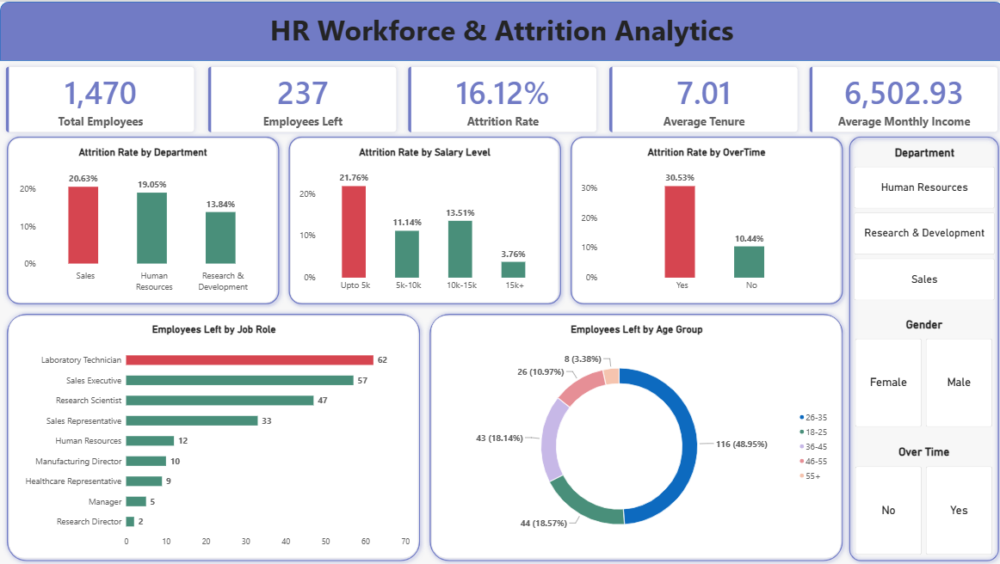
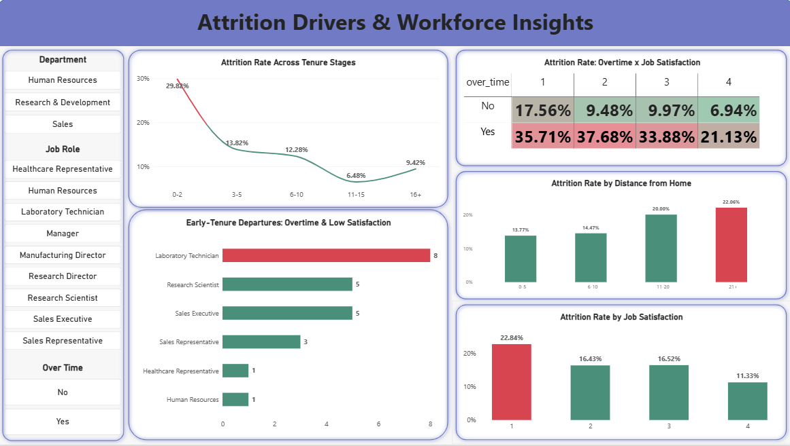

# HR Workforce & Attrition Analytics

An end-to-end HR analytics project analyzing employee workforce data to identify patterns associated with observed employee attrition using **Python, Pandas, PostgreSQL, SQL, and Power BI**.



## Project Overview

This project analyzes **1,470 unique employees** to understand where attrition is concentrated and how factors such as department, salary, overtime, job satisfaction, tenure, and distance from home relate to observed attrition.

### Workflow

**Python → Data Cleaning → EDA → Feature Engineering → PostgreSQL → SQL Analysis → Power BI → Business Insights**

---

## Business Problem

The objective was to turn raw employee data into actionable workforce insights by answering questions such as:

- Where is observed attrition concentrated?
- Which departments and job roles show higher observed attrition?
- How does attrition vary across salary levels?
- How does overtime relate to attrition?
- Which tenure stages show higher attrition?
- How does job satisfaction relate to observed attrition?
- Which employee segments warrant further investigation?

---

## Dataset

| Metric | Value |
|---|---:|
| Original Records | 1,480 |
| Original Columns | 38 |
| Final Employees | 1,470 |
| Final Columns | 37 |
| Employees Who Left | 237 |
| Employees Who Stayed | 1,233 |
| Overall Attrition Rate | 16.12% |

Key variables analyzed include:

`department`, `job_role`, `monthly_income`, `salary_slab`, `over_time`, `job_satisfaction`, `years_at_company`, `distance_from_home`, `years_since_last_promotion`, and `attrition`.

---

## Data Cleaning & Preparation

Data cleaning was performed using **Python and Pandas**.

- Identified **10 duplicate employee IDs**
- Removed **7 exact duplicate rows**
- Investigated conflicting duplicate records
- Treated inconsistent `years_with_curr_manager` values as missing rather than guessing
- Removed non-informative columns:
  - `employee_count`
  - `over18`
  - `standard_hours`
  - `employee_number`
- Standardized column names to `snake_case`
- Preserved genuine missing values
- Created:
  - `tenure_group`
  - `distance_group`
  - `promotion_group`

The final dataset contains **60 missing values** in `years_with_curr_manager`.

---

## Exploratory Data Analysis

EDA was performed in Python to examine workforce characteristics and identify observed attrition patterns.

### Department

| Department | Observed Attrition |
|---|---:|
| Sales | 20.63% |
| Human Resources | 19.05% |
| Research & Development | 13.84% |

### Overtime

| Overtime | Observed Attrition |
|---|---:|
| Yes | 30.53% |
| No | 10.44% |

### Salary Level

| Salary Level | Observed Attrition |
|---|---:|
| Up to 5k | ~21.8% |
| 15k+ | ~3.8% |

### Tenure

Employees with **0–2 years at the company** recorded an observed attrition rate of **29.82%**.

### Job Satisfaction

| Satisfaction Level | Observed Attrition |
|---|---:|
| 1 | 22.9% |
| 4 | 11.3% |

### Distance from Home

| Distance Group | Observed Attrition |
|---|---:|
| 0–5 | ~13.8% |
| 21+ | ~22.1% |

These figures represent observed patterns in the dataset and do not establish causation.

---

## PostgreSQL & SQL Analysis

The cleaned dataset was loaded into PostgreSQL as:

`public.hr_employee_data`

I developed **9 business-focused SQL analyses** covering:

1. Overtime-related attrition exposure by department
2. Attrition concentration by department and job role
3. Attrition across salary levels
4. Job-role share of total departures
5. Employee profile comparison between employees who left and stayed
6. Attrition by job satisfaction
7. Employees who already left and matched key attrition indicators
8. Attrition across tenure stages
9. Overtime × job-satisfaction attrition segments

### SQL Techniques

- `GROUP BY`
- `CASE`
- Conditional aggregation
- `FILTER`
- `HAVING`
- Window functions
- `RANK()`
- Segmentation
- Percentage calculations

[View SQL Queries](sql/HR_Analytics_Queries.sql)

---

## Power BI Dashboard

The Power BI dashboard contains two pages for workforce monitoring and deeper attrition analysis.

### 1. Workforce & Attrition Overview


**KPIs**
- Total Employees
- Employees Left
- Attrition Rate
- Average Tenure
- Average Monthly Income

**Analysis**
- Attrition Rate by Department
- Attrition Rate by Salary Level
- Attrition Rate by Overtime
- Employees Left by Job Role
- Employees Left by Age Group

**Slicers**
- Department
- Gender
- Overtime

### 2. Attrition Drivers & Workforce Insights



**Analysis**
- Attrition Rate Across Tenure Stages
- Attrition Rate by Job Satisfaction
- Overtime × Job Satisfaction
- Attrition Rate by Distance from Home
- Early-Tenure, Overtime & Low-Satisfaction Departures by Job Role

**Slicers**
- Department
- Job Role
- Overtime

---

## Key Findings

- **Early tenure:** The 0–2 year group recorded **29.82% observed attrition**.
- **Overtime:** Employees working overtime recorded **30.53% observed attrition**, compared with **10.44%** without overtime.
- **Department:** Sales recorded **20.63% observed attrition**, followed by Human Resources at **19.05%**.
- **Salary:** The up-to-5k salary group recorded approximately **21.8% observed attrition**, compared with approximately **3.8%** for the 15k+ group.
- **Job satisfaction:** Satisfaction level 1 recorded **22.9% observed attrition**, compared with **11.3%** at level 4.
- **Distance:** The 21+ distance group recorded approximately **22.1% observed attrition**, compared with approximately **13.8%** for the 0–5 group.

---

## Business Recommendations

Based on the observed patterns, areas for further HR investigation include:

- Reviewing the early-tenure employee experience
- Investigating workload and overtime patterns
- Monitoring low job-satisfaction segments
- Reviewing compensation patterns across employee groups
- Examining employee experience associated with longer commuting distances
- Using dashboard KPIs for ongoing workforce monitoring

---

## Limitations

- The analysis is based on a single HR dataset.
- Observed relationships do not establish causation.
- 60 missing values remain in `years_with_curr_manager`.
- The dataset represents a single snapshot rather than time-based trends.
- Some role-level segments may have relatively small sample sizes.
- Qualitative information such as exit-interview responses is not available.
- The project focuses on descriptive analytics and does not include a predictive attrition model.

---

## Future Scope

- Build an attrition prediction model
- Add statistical testing
- Incorporate employee survey and exit-interview data
- Automate data refresh and reporting
- Add a natural-language interface for HR analytics

---

## Repository Structure

```text
HR-Workforce-Attrition-Analytics/
│
├── data/
│   └── HR_Analytics_Final.csv
│
├── notebooks/
│   └── HR_Analytics_EDA.ipynb
│
├── powerbi/
│   └── HR_Workforce_Attrition_Analytics.pbix
│
├── report/
│   └── HR_Workforce_Attrition_Analytics_Report.pdf
│
├── screenshots/
│   ├── dashboard_overview.png
│   └── attrition_drivers.png
│
├── sql/
│   └── HR_Analytics_Queries.sql
│
└── README.md
